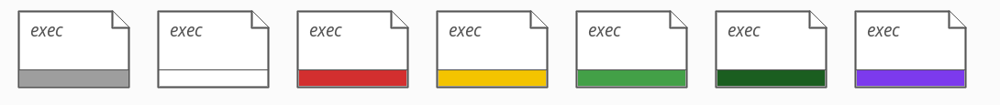
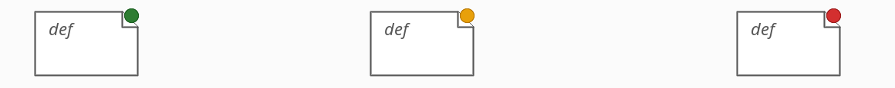

# Atoms: roles and statuses

A proposal for a **minimal** colouring scheme that is still informative. It
covers Verus and Aeneas (Rust) projects and Lean projects, and says, for every
colour, where the information comes from.

Context: [`probes_statuses_colours.md`](probes_statuses_colours.md) and
`VeriLib_Atom_Proposal.pdf`.

## Two visual channels

An atom carries at most two independent signals:

| Channel | Where | What it means | Which atoms |
|---------|-------|---------------|-------------|
| **Colour bar** (bottom) | Verification status | does the implementation meet its spec? | Rust `exec` |
| **Colour dot** (top-right) | Checking status | does the tool accept the artifact? | verification artifacts |

"Verification artifacts" are Verus specs and proofs, and Lean defs and theorems.
They get a **dot, not a bar**: the question for them is not "meets its spec" but
"does it go through".

The two channels split cleanly by `language` (per
[P20](../kb/engineering/properties.md#p20-language-is-derived-from-kind-not-lexical-scope)):
`language: "rust"` (kind `exec`) → **bar**; `language: "verus"` (Verus spec /
proof) and `language: "lean"` (any Lean atom) → **dot**.

Optional classification (scheme / construction / correctness / security) is shown
by border colour. It is not a status.

## Kind — the top-left label

The label at the top-left corner is exactly the atom's `kind` field from the
JSON, verbatim. Possible values:

- **Rust (Verus / Aeneas):** `exec`, `spec`, `proof`
- **Lean:** `def`, `abbrev`, `class`, `structure`, `inductive`, `instance`, `opaque`, `quot`, `axiom`, `theorem`

## Colour bar — Rust `exec` (Verus and Aeneas projects)

The status rides on a **bar at the bottom** of the atom, in the seven colours
of the table below (white = an empty bar: tracked, no spec yet):



The bar is a pure function of `is-disabled` and `verification-status` on the Rust
`exec` atom (exactly what [`scripts/count-colors.sh`](../scripts/count-colors.sh)
counts):

| Bar | JSON condition | Meaning |
|-----|----------------|---------|
| **grey** | `is-disabled: true` | disabled — out of verification scope (see below) |
| **white** | no `verification-status` | tracked — in scope, no spec yet (empty bar = intent to verify) |
| **red** | `verification-status: "failed"` | error — verification failed |
| **yellow** | `verification-status: "unverified"` | incomplete proof: a Lean `sorry` or a Verus `assume()` |
| **light green** | `verification-status: "verified"` | locally verified — meets its spec |
| **dark green** | `verification-status: "transitively-verified"` | verified, and so are all its dependencies |
| **purple** | `verification-status: "trusted"` | assumed correct (Verus `#[verifier::external_body]` / `admit()`, Lean axiom / `*External.lean`) |

The bar is what makes white unambiguous: a **white bar** means a tracked,
not-yet-specified Rust function; **no bar at all** means a pure-Rust project atom
with no verification intent, for Rust projects alone.

## Colour dot — verification artifacts

The status rides on a **dot at the top-right corner** of the artifact, a pure
function of `verification-status`:



| Dot | JSON condition | Meaning |
|-----|----------------|---------|
| **red** | `verification-status: "failed"` | fails to check |
| **yellow** | `verification-status: "unverified"` | checks, with an incompleteness warning (`sorry` / `assume`) |
| **green** | anything else (`"verified"` / `"transitively-verified"` / `"trusted"` / none) | accepted by the tool |

red/green are always from the build/verify command. Yellow is from the
command for Lean, but from the probe's source scan for Verus.

## Legend (Verus / Aeneas)

What a Rust function's bar colour means, in plain words:

- **grey — not tracked.** Deliberately outside the verification effort; ignored in every count.
- **white — tracked, not started.** In scope, no spec yet — the work backlog.
- **red — broken.** Has a spec; verification errors out.
- **yellow — in progress.** Has a spec; the verification is incomplete (a `sorry` / `assume()`).
- **light green — verified.** Verified against its spec.
- **dark green — verified end-to-end.** Verified, and so is every dependency.
- **purple — trusted.** Deliberately assumed, not verified — the trust base.

**Tracked** = every Rust function that is in verification scope = all bar colours
except grey. Every Rust function is tracked by default; one leaves the tracked
set only when the code explicitly marks it out of scope (Verus
`#[verifier::external]`; Aeneas untranslated or `@[out_of_scope]`). Progress is
`#verified / #tracked`, and a project is **done** when every tracked function is
green.

## Tracking and the denominator

Every Rust function is **tracked by default** (white bar). Out-of-scope is stated
explicitly in the code and read by the probes:

- **Verus** — `#[verifier::external]`, cfg-inactive code, or an external-crate
  stub → `is-disabled: true` → **grey**.
- **Aeneas** — a Rust function whose Charon RQN is absent from `functions.json`
  (not translated / not compiled / behind a gate), or a Lean-side
  `@[out_of_scope]` annotation on its translation → `is-disabled: true` → **grey**.

This gives a well-defined denominator, so we can report

```
#verified / #tracked      where #tracked = all exec atoms − grey (is-disabled)
```

## Lean projects

Lean has no notion of "tracked" (no exec side to be the denominator), so:

- **No numbers** — we do not report `#verified / #tracked`.
- Atoms carry only the **coloured dot** (red / yellow / green from `lake build`).

Richer views are possible where the project supplies more structure:

- **Verso-blueprint projects** — annotations declare what each item is meant to
  be. A dedicated **`probe-verso-blueprint`** probe would surface those
  annotations, enabling def/thm roles and progress views.
- **Security protocols formalised in Lean** — a separate question, deferred.

## Open question — statistics for artifacts

Artifacts have no "tracked" denominator (that is a bar-channel notion), but two
ratios over the theorems could still be informative:

- `#yellow / #theorems` — the fraction of theorems that still carry a `sorry` /
  `assume` (`verification-status: "unverified"`).
- `#purple / #theorems` — the fraction resting on axioms / trusted models
  (`verification-status: "trusted"`; shown as a green dot since it *checks*, but
  countable separately).

Open: whether to show these at all (they would give Lean projects some numbers,
which we otherwise avoid), and what the denominator should be — all theorems, or
all artifacts.
