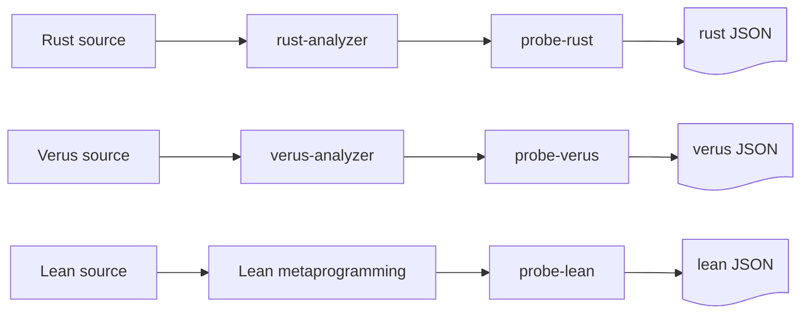
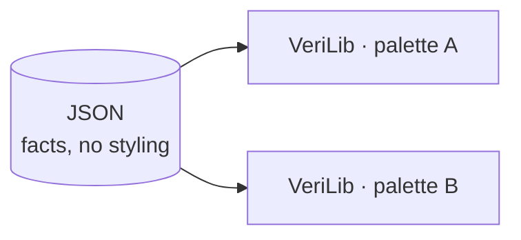

# Probes: factual data about (verified) code

---

## What the probes are

The probes use code indexers to extract structured data about a codebase. They read what the indexer already understands and write it down.



probe-aeneas has no indexer of its own. It uses probe-rust and probe-lean, and joins them.

---

## The probes generate JSON

Every probe emits the same shape of data: one entry per code atom (a rust function, a verus construct, a lean construct), with its dependencies. What each pipeline can say about an atom depends on what its indexer knows.

| Project | Typical information per atom |
|---------|------------------------------|
| Rust | function calls (the call graph) |
| Verus, Aeneas | function calls plus verification status |
| Lean | dependencies plus proof status |

The schemas for each probe are described in each probe repo. [Links](https://github.com/Beneficial-AI-Foundation/probe#per-tool-docs-across-the-ecosystem)

---

## A Verus atom

From `dalek-verus/.../verus_curve25519-dalek_4.1.3.json`. A Rust function, its calls, and whether it verifies against its spec.

```json
"probe:curve25519-dalek/4.1.3/.../[ProjectivePoint]double()": {
  "kind": "exec",
  "language": "rust",
  "code-path": "src/backend/serial/curve_models/mod.rs",
  "primary-spec": "requires\n  is_valid_projective_point(*self),\n  ensures ...",
  "verification-status": "transitively-verified",
  "dependencies": [
    "probe:.../[FieldElement51]square()",
    "probe:.../[FieldElement51]square2()"
  ]
}
```

---

## probe-aeneas: probe-rust plus probe-lean

An Aeneas project has two sides: the Rust crate, and the Aeneas-generated Lean that models it and the specs proved about it. probe-aeneas runs both probes and links their output.

- **probe-rust** indexes the Rust crate with rust-analyzer, and additionally runs Charon to tag each Rust function with a Charon-derived qualified name.
- **probe-lean** indexes the Lean side, where each Aeneas-generated definition remembers the Rust function it came from.

The Rust atoms carry rust-analyzer ids; the Lean translations speak Charon names. Charon is the shared vocabulary: tagging each rust-analyzer atom with its Charon-derived qualified name is what makes the two comparable. Matching those names links a Rust function to the Lean definition that implements it and the theorem that specifies it.

---

## An Aeneas atom: Rust and Lean, linked

The Rust function. Its `rust-qualified-name` is the Charon-derived name, and `translation-name` points to its Lean side.

```json
"probe:curve25519-dalek/4.2.0/edwards/impl<&Scalar>#[EdwardsPoint]mul_base()": {
  "kind": "exec",
  "language": "rust",
  "rust-qualified-name": "curve25519_dalek::edwards::{...EdwardsPoint}::mul_base",
  "translation-name": "probe:curve25519_dalek.edwards.EdwardsPoint.mul_base",
  "verification-status": "transitively-verified",
  "dependencies": ["probe:.../[Mul<&EdwardsBasepointTable>]mul()"]
}
```

The Lean translation it points to, paired with the theorem that specifies it.

```json
"probe:curve25519_dalek.edwards.EdwardsPoint.mul_base": {
  "kind": "def",
  "language": "lean",
  "rust-source": "curve25519-dalek/src/edwards.rs",
  "primary-spec": "probe:curve25519_dalek.edwards.EdwardsPoint.mul_base_spec",
  "verification-status": "verified",
  "dependencies": [
    "probe:...constants.ED25519_BASEPOINT_POINT",
    "probe:curve25519_dalek.edwards.EdwardsPoint"
  ]
}
```

---

## Three kinds of projects, three questions

We work with three kinds of projects (until now), and each asks a different question.

```
┌──────────────────┐  ┌──────────────────┐  ┌───────────────────┐
│  Functional      │  │  Mathlib-style   │  │  Security         │
│  verification    │  │  formalization   │  │  protocol (Lean)  │
│                  │  │                  │  │                   │
│   f ⊨ spec       │  │     ⊢  thm       │  │    AEAD           │
│                  │  │                  │  │                   │
│  "does f meet    │  │  "is it          │  │  "is the          │
│   its spec?"     │  │   proved?"       │  │   construction    │
│                  │  │                  │  │   secure?"        │
└──────────────────┘  └──────────────────┘  └───────────────────┘
```

The questions, to me, are different in nature and we should deal with each in a different way.

---

## One framework for all three can mislead

We could try to see all three types (and potentially other types of projects that will appear) in the same way. In the end, any program boils down to 0s and 1s. But i think by doing so we lose meaning.

---

## Probes provide data; VeriLib displays it

The probes have one job: provide factual data about the code, as JSON.

VeriLib takes that data and presents it currently by colors and statistics.

Colors and what to take as input for stats should be helpful but the questions "what colours, what stats" are also somewhat subjective (what one might find useful, another person would say "nay") so we need to reach consensus knowing we might not make everyone happy. 

Take-away: probes only report facts about the code and take no position on how those facts should appear on verilib.



---

## Typical probe bugs

- if a theorem appears as unproved when it should be proved
- if a construct doesn't appear in the json (for instance, what Sergiu noticed about private lean lemmas)
- more generally, inconsistencies between what the code says and what the json says

---

## Typical probe "features"

- probe-aeneas was designed starting from the only existing aeneas project: dalek-lean; spqr-verify then decided to use a different structure (to separate aeneas generated code from manually written lean code); consequently, probe-aeneas needed to be updated to work with the new structure
- there are many sorts of projects, some have lakefile.toml at top level, some in a subfolder; some put some sort of info in lakefile.toml, others other sort of info; we could say that the human creativity is infinite so expecting that a probe tool a priori handles any type of project is futile;
- in some cases, it is also almost impossible to handle some projects: for instance, some lean projects require to install different libraries, tools but only in written, but the probe tools won't be able to install whatever the authors of a project describe in words 

---

## Colors

With that separation in mind, we can talk about colors as a VeriLib concern, on top of the factual data the probes provide.

---

## Currently

The current design VeriLib offers fits functional verification projects. 

Statuses:


Colors:


There's a gap between them (we should have a 1-to-1 correspondence between statuses and colours)

---

## Statuses

The probes don't (cannot) emit info about:
- a function being tracked
- a spec being validated 

In the current verif projects:
- specs are validated through PRs, if a spec exists in the codebase, then it's validated
- there's nothing saying that a function is tracked

---

## Tracking

- we can say that a priori all functions are tracked; but in the end, we don't verify all functions (for instance, in dalek-verus, we didn't verify serialization, formatting...); so, in order to not have whites in what we considered a finished dalek, i took the liberty to say that any function that doesn't have a spec is disabled (this rule disables also tests)
- if we introduce some sort of annotation which says "exclude from verification", then we can have "by default, any function which is excluded from verification is tracked"; we haven't adopted such an annotation yet (and i doubt all other verus projects will adopt our convention; we want the probes to apply to projects regardless of the conventions our teams would adopt)

So:
- either we have: by default we track everything and a finished verification project will have tracked but not verified
- or, by default, if a function doesn't have a spec it is considered as disabled; once we add a spec, it will have a verification status and we will see in the progress chart one more verified function (without having a total upper bound)

---

## White

- currently, we use white for both rust projects (no verification) and for tracked functions, to me, it's inconsistent;
 if we want that VeriLib displays rust projects, then white seems to be the natural colour to display rust functions (to convery the message: not for verification); black, as the absence of colour would be a better choice conceptually but visually, probably not

 So we need to decide how to distinguish between: an atom in a rust project; a tracked atom 

 If we give up the notion of tracked functions, we no longer have a problem: white can be for "outside verification scope".

 ---

 ## Colour-Status mapping proposal

- <span style="color:#808080; font-weight:700">disabled</span>
- <span style="color:#C99A00; font-weight:700">translated</span> (only for Aeneas)
- <span style="color:#E8710A; font-weight:700">sorry / assumes</span>
- <span style="color:#D32F2F; font-weight:700">error</span>
- <span style="color:#2E7D32; font-weight:700">verified</span> (for a function verifies a spec and for a theorem is proved)
- <span style="color:#7C3AED; font-weight:700">trusted</span>

---

## Green

- for verification projects, i think we're fine with green to denote verified for a "function satisfies its spec"
- for mathlib projects, i think we're fine with green to denote proved "a theorem is proved"; i think it's somewhat misleading to use green for "a definition compiles"; see [this arbitrary def](https://github.com/digama0/lean4lean/blob/master/Lean4Lean/Theory/VDecl.lean#L11), i think it's misleading to have green as "this definition compiles" as the green in "this function satisfies its spec"


---

## Lean defs

My suggestion is to deal with lean defs depending on from where they come:
- defs generated by aeneas: can be considered as having green in that they model implemenations?
- for lean projects with verso-blueprint: we can assume that the authors of those projects already selected what they want to see so a wrapper to verso blueprint is the way to go
- for generic lean projects without annotations/verso blueprint, the most we could say is which theorems are proved and which aren't (for these projects i would want to not have green defs)
- for vcvio based projects: we can leverage a bit and deduce more info like Jin did
- for other lean projects that might come later: we'll extend/build upon probe-lean depending on the project


---

## Blue

- VeriLib uses blue for "has a spec but no proof"; the thing is that if we have a function spec we also have a proof which verifies or not; so blue is eaten by green/orange/red
- there is only one case for blue for specs: in Verus, we have specs which are used in pre/post conditions for rust functions

--- 

## Shapes

- should distinguish roles; can be def/thm like in verso-blueprint; not sure if it makes sense for verus...