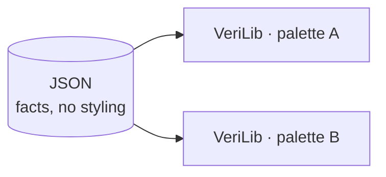

# Probes: factual data about (verified) code

---

## What the probes are

The probes use code indexers to extract structured data about a codebase. They read what the indexer already understands and write it down.


probe-aeneas has no indexer of its own. It uses probe-rust and probe-lean, and joins them.

---

## The probes generate JSON

Every probe emits the same shape of data: one entry per code atom (a rust function, a verus construct, a lean construct), with its [dependencies and other info](https://github.com/Beneficial-AI-Foundation/probe#per-tool-docs-across-the-ecosystem). 

| Project | Typical information per atom |
|---------|------------------------------|
| Rust | function calls (the call graph) |
| Verus, Aeneas | function calls plus verification status; thm dependencies plus proof status |
| Lean | thm dependencies plus proof status |

---

## A Verus atom

From `dalek-verus/.../verus_curve25519-dalek_4.1.3.json`. A Rust function, its calls, and whether it verifies against its spec.

```json
"probe:curve25519-dalek/4.1.3/.../[ProjectivePoint]double()": {
  "kind": "exec",
  "language": "rust",
  "code-path": "src/backend/serial/curve_models/mod.rs",
  "primary-spec": "requires\n  is_valid_projective_point(*self),\n  ensures ...",
  "verification-status": "transitively-verified",
  "dependencies": [
    "probe:.../[FieldElement51]square()",
    "probe:.../[FieldElement51]square2()"
  ]
}
```

---

## probe-aeneas: probe-rust plus probe-lean

An Aeneas project has two sides: the Rust crate, and the Aeneas-generated Lean that models it and the specs proved about it. probe-aeneas runs both probes and links their output.

- **probe-rust** indexes the Rust crate with rust-analyzer, and additionally runs Charon to tag each Rust function with a Charon-derived qualified name.
- **probe-lean** indexes the Lean side, where each Aeneas-generated definition remembers the Rust function it came from.

The Rust atoms carry rust-analyzer ids; the Lean translations speak Charon names. Charon is the shared vocabulary: tagging each rust-analyzer atom with its Charon-derived qualified name is what makes the two comparable. Matching those names links a Rust function to the Lean definition that implements it and the theorem that specifies it.

---

## An Aeneas atom: Rust and Lean, linked

The Rust function. Its `rust-qualified-name` is the Charon-derived name, and `translation-name` points to its Lean side.

```json
"probe:curve25519-dalek/4.2.0/edwards/impl<&Scalar>#[EdwardsPoint]mul_base()": {
  "kind": "exec",
  "language": "rust",
  "rust-qualified-name": "curve25519_dalek::edwards::{...EdwardsPoint}::mul_base",
  "translation-name": "probe:curve25519_dalek.edwards.EdwardsPoint.mul_base",
  "verification-status": "transitively-verified",
  "dependencies": ["probe:.../[Mul<&EdwardsBasepointTable>]mul()"]
}
```

The Lean translation it points to, paired with the theorem that specifies it.

```json
"probe:curve25519_dalek.edwards.EdwardsPoint.mul_base": {
  "kind": "def",
  "language": "lean",
  "rust-source": "curve25519-dalek/src/edwards.rs",
  "primary-spec": "probe:curve25519_dalek.edwards.EdwardsPoint.mul_base_spec",
  "verification-status": "verified",
  "dependencies": [
    "probe:...constants.ED25519_BASEPOINT_POINT",
    "probe:curve25519_dalek.edwards.EdwardsPoint"
  ]
}
```

---

## Three kinds of projects, three questions

We work with three kinds of projects (until now), and each asks a different question.

```
┌──────────────────┐  ┌──────────────────┐  ┌───────────────────┐
│  Functional      │  │  Mathlib-style   │  │  Security         │
│  verification    │  │  formalization   │  │  protocol (Lean)  │
│                  │  │                  │  │                   │
│   f ⊨ spec       │  │     ⊢  thm       │  │    AEAD ⊨ secure  │
│                  │  │                  │  │                   │
│  "does f meet    │  │  "is thm         │  │  "is the AEAD     │
│   its spec?"     │  │   proved?"       │  │   construction    │
│                  │  │                  │  │   secure?"        │
└──────────────────┘  └──────────────────┘  └───────────────────┘
```

The questions, to me, are different in nature and we should deal with each in a different way.

---

## One framework for all three can mislead

We could try to see all three types (and potentially other types of projects that will appear) in the same way. In the end, any program boils down to 0s and 1s. But i think by doing so we lose meaning.

---

## Probes provide data; VeriLib displays it

The probes have one job: provide factual data about the code, as JSON.

VeriLib takes that data and presents it currently by colouring atoms and statistics.

- colours and what to take as input for stats should be helpful for the end user; 
- the questions "what colours, what stats" are also somewhat subjective: what one might find useful, another person would say "nay"



So we need to reach consensus knowing we might not make everyone happy. 

Take-away: probes only report facts about the code and take no position on how those facts should appear on verilib.


---

## Typical probe bugs

- if a theorem appears as unproved when it should be proved
- if a construct doesn't appear in the json (for instance, what Sergiu noticed about private lean lemmas)
- more generally, inconsistencies between what the code says and what the json says

---

## Typical probe "features"

- probe-aeneas was designed starting from the __only__ existing aeneas project: dalek-lean; spqr-verify decided to use a different structure (to separate aeneas generated code from manually written lean code); consequently, probe-aeneas needed to be updated to work with the new project structure
- there are many sorts of projects, some have lakefile.toml at top level, some in a subfolder; some put some sort of info in lakefile.toml, others other sort of info; we could say that the human creativity is infinite so expecting that a probe tool a priori handles any type of project is futile;
- in some cases, it is also almost impossible to handle some projects: for instance, some lean projects require to install different libraries, tools but the info is provided only in written; the probe tools won't be able to install whatever the authors of a project describe in words 

---

## Colours

With that separation in mind, we can talk about colours as a VeriLib concern, on top of the factual data the probes provide.

---

## Currently

The current design VeriLib offers fits functional verification projects. 

Statuses:


Colors:


There's a gap between them (we should have a 1-to-1 correspondence between statuses and colours)

---

## Statuses

The probes don't (cannot) emit info about:
- a function being tracked
- a spec being validated 

In the current verif projects:
- specs are validated through PRs, if a spec exists in the codebase, then it's validated
- there's nothing in the code saying that a function is tracked

---

## Tracking

- we can say that a priori all functions are tracked; but in the end, we don't verify all functions (for instance, in dalek-verus, we didn't verify serialization, formatting...); so, in order to not have whites in what we considered a finished dalek, i took the liberty to say that any function that doesn't have a spec is disabled (this rule disables also tests)
- if we introduce some sort of annotation which says "exclude from verification", then we can have "by default, any function which is excluded from verification is tracked"; we haven't adopted such an annotation yet (and i doubt all other verus projects will adopt our convention; we want the probes to apply to projects regardless of the conventions our teams would adopt)

So:
- either we have: by default we track everything and a finished verification project will have tracked but not verified
- or, by default, if a function doesn't have a spec, it is considered as disabled; once we add a spec, it will have a verification status and we will see in the progress chart one more verified function (without having a total upper bound)

---

## White

- currently, we use white for both rust projects (no verification) and for tracked functions, to me, it's inconsistent;
 if we want that VeriLib displays rust projects, then white seems to be a "neutral" colour to display rust functions (to convery the message: not for verification); black, as the absence of colour, would be a better choice conceptually but visually, probably not

 So we need to decide how to distinguish between: an atom in a rust project; a tracked atom 

 If we give up the notion of tracked functions, we no longer have a problem: white can be used for "outside verification scope".

 ---

 ## Colour-Status mapping proposal

- <span style="color:#808080; font-weight:700">disabled</span>
- <span style="color:#C99A00; font-weight:700">translated</span> (only for Aeneas)
- <span style="color:#E8710A; font-weight:700">sorry / assumes</span>
- <span style="color:#D32F2F; font-weight:700">error</span>
- <span style="color:#2E7D32; font-weight:700">verified</span> (for a function verifies a spec, for a theorem is proved)
- <span style="color:#7C3AED; font-weight:700">trusted</span>

---

## <span style="color:#2E7D32; font-weight:700">Green</span>

- for verification projects, i think we're fine with green to denote verified for a "function satisfies its spec"
- for mathlib projects, i think we're fine with green to denote proved "a theorem is proved"; i think it's somewhat misleading to use green for "a definition compiles"; see [this arbitrary def](https://github.com/digama0/lean4lean/blob/master/Lean4Lean/Theory/VDecl.lean#L11), i think it's misleading to have green as "this definition compiles" as the green in "this function satisfies its spec"


---

## Lean defs

My suggestion is to deal with lean defs depending on where they come from:
- defs generated by aeneas: can be considered as having green in that they model implemenations?
- for lean projects with verso-blueprint: we can assume that the authors of those projects already selected what they want to see so a wrapper to verso blueprint is the way to go
- for generic lean projects without annotations/verso blueprint, the most we could say is which theorems are proved and which aren't (for these projects i would want to not have green defs)
- for vcvio based projects: we can leverage a bit and deduce more info like Jin did
- for other lean projects that might come later: we'll extend/build upon probe-lean depending on the project


---

## <span style="color:#2563EB">Blue</span>

- VeriLib uses blue for "has a spec but no proof"; the thing is that if we have a function spec we also have a proof which verifies or not; so blue is eaten by green/orange/red
- there is only one case for blue for specs: in Verus, we have specs which are used in pre/post conditions for rust functions, to take an example [to_nat](https://github.com/Beneficial-AI-Foundation/dalek-verus/blob/9bb7fd09c3b9dbd52ff2dca9a75e618c751b79a7/curve25519-dalek/src/specs/core_specs.rs#L229); in aeneas projects, we have similar defs, these could be blue.

Note though:
- in Verus, we have a dedicated syntax `spec fn`; in Lean, we only have `def`; so a Lean def can play the role of an impl, of a spec, or none; without some sort of user annotation, it's hard to differentiate the role of a def.

--- 

## Same function, same spec, two styles

`FieldElement51::is_negative`: the result is true exactly when the canonical representative (mod `p = 2^255 - 19`) is odd. Verified both ways, so the specs assert the same thing.

Colour key: <span style="color:#2563EB">spec</span>, <span style="color:#2E7D32">proof</span>, plain text is code.

<table>
<tr><th>Verus (dalek-verus)</th><th>Lean via Aeneas</th></tr>
<tr valign="top">
<td>

<pre><code>// src/field.rs
fn is_negative(&amp;self) -&gt; (result: Choice)
<span style="color:#2563EB">    ensures
        // true iff the canonical rep (mod p) is odd
        choice_is_true(result)
          == (spec_fe51_as_bytes(self)[0] &amp; 1 == 1),
</span>{
    let bytes = self.as_bytes();
    let result = Choice::from(bytes[0] &amp; 1);
<span style="color:#2E7D32">    proof {
        lemma_as_bytes_equals_spec_fe51(self, &amp;bytes);
    }
</span>    result
}</code></pre>

</td>
<td>

<pre><code>def FieldElement51.is_negative
    (self : FieldElement51) : Result Choice := do
  let bytes ← FieldElement51.to_bytes self
  let i     ← Array.index_usize bytes 0
  Choice.from (i &amp;&amp;&amp; 1)

@[step] theorem is_negative_spec (self : FieldElement51) :
<span style="color:#2563EB">    is_negative self ⦃ (c : Choice) =&gt;
      c.val = 1 ↔ (Field51_as_Nat self % p) % 2 = 1 ⦄
</span><span style="color:#2E7D32">  := by unfold is_negative; step*</span></code></pre>

</td>
</tr>
</table>

- Both specs state the same property: `result` is true iff the field element's canonical representative is odd.
- Verus keeps the <span style="color:#2563EB">spec</span> and the <span style="color:#2E7D32">proof</span> inside the function. One artifact holds code, spec and proof.
- Aeneas gives Lean the function as a plain-code `def`. The <span style="color:#2563EB">spec</span> (the theorem's statement) and its <span style="color:#2E7D32">proof</span> live in a separate theorem.
- Only phrasing differs: Verus reads parity off the low byte of the canonical encoding, Lean off `value % p % 2`. Same property, two ways to write it.

---

## Shapes

Colours for statuses, shapes for roles:
- can be def/thm like in verso-blueprint; not sure if it makes sense for verus...
- can be impl/spec/proof; could make sense for Verus; not much for Lean spec-theorems; maybe just impl/spec? just have a shape for specs?

---

## Lean projects formalizing security protocols

- currently, the ones we have are based on VCVio
- typically, the specs are either correctness or security theorems; these can be coloured <span style="color:#E8710A; font-weight:700">orange</span>/<span style="color:#D32F2F; font-weight:700">red</span>/<span style="color:#2E7D32; font-weight:700">green</span>/<span style="color:#7C3AED; font-weight:700">purple</span>
- i wouldn't colour something more
- maybe i'd use a shape to distinguish schemes/constructions??
- [Jin has already implemented a PoC](https://github.com/Beneficial-AI-Foundation/probe-lean/blob/main/docs/classification-security-protocol.md):
  - probe-lean detects if we deal with a vcvio project (from lakefile.toml)
  - it generates additional data such as scheme -> construction -> correctness prop/security prop (for schemes, it relies on a naming convention with `scheme` as a suffix; we need annotations like Alessandro suggested to not miss schemes not following this convention)
  - with this new info, VeriLib could have an option "show me scheme <x>" where the user gives the name of the scheme; then VeriLib would show scheme <x> together with its construction and its correctness/security props. 

## Questions

- What do we want to see on VeriLib? 
  - if we want to read green as "this function satisfies its spec" or "this theorem is proved", then:
      - arbitrary Lean defs shouldn't have a verification colour
      - aeneas generated Lean defs should have one of the following colours <span style="color:#C99A00; font-weight:700">yellow</span>/<span style="color:#E8710A; font-weight:700">orange</span>/<span style="color:#D32F2F; font-weight:700">red</span>/<span style="color:#2E7D32; font-weight:700">green</span>/<span style="color:#7C3AED; font-weight:700">purple</span>
      - note that an aeneas generated def being <span style="color:#C99A00; font-weight:700">yellow</span> means it doesn't have a spec; once it has a spec, it will have the same status/colour as the spec, one of <span style="color:#E8710A; font-weight:700">orange</span>/<span style="color:#D32F2F; font-weight:700">red</span>/<span style="color:#2E7D32; font-weight:700">green</span>/<span style="color:#7C3AED; font-weight:700">purple</span>  (note to myself: need to update probe-aeneas to reflect this)
  - the above proposal is described [here](https://github.com/Beneficial-AI-Foundation/probe/blob/78d069ebc7c7856ab116387dba333f85bf1156c0/docs/verification-statuses.md)

- Do we want to see <span style="color:#2563EB">blue</span> for specs (not for a function being specified)?
  - Verus specs are easy to detect (syntax `spec fn`); Lean defs that correspond to specs aren't (unless user annotated); the simplest solution in order to have a consistent framework would be to not colour specs; (though it bothers me somehow to not be able to identify visually the specs in a verification project)
  - note also that having blue for specs is a deviation from colours map to statuses in that a spec is a role, not a status (so maybe we could we should distinguish specs not by colour but by shape)

- Do we want tracked to be by default any rust function?
  - If yes, in order to have a finished verification project with no tracked functions which aren't specified, we'd need to use an annotation like `outside_verif_scope` (projects not using such an annotation will appear as incomplete on VeriLib)
  - If no (the current setup), we don't have an upper bound for functions we will verify (though on the progress chart we'll see the number of verified functions increasing)

- Do we want to display pure Rust projects on VeriLib?
  - if yes, what colour should those atoms have?

---

## Same function, two ways: Verus and Lean (Aeneas)

`FieldElement51 + FieldElement51`, verified in both projects (code abridged).

<table>
<tr><th>Verus (dalek-verus)</th><th>Lean via Aeneas</th></tr>
<tr valign="top">
<td>

<pre><code>impl&lt;&#x27;a&gt; Add for &amp;&#x27;a FieldElement51 {
  fn add(self, rhs: &amp;FieldElement51)
        -&gt; (out: FieldElement51)
    ensures
      // element-wise sum of the limbs
      fe51_as_nat(&amp;out)
        == fe51_as_nat(self) + fe51_as_nat(rhs),
      // bound propagation
      bounded(self, 51) &amp;&amp; bounded(rhs, 51)
        ==&gt; bounded(&amp;out, 52),
  {
    let mut out = *self;
    for i in 0..5
      invariant /* limb i is summed */
    { out.limbs[i] += rhs.limbs[i]; }
    proof { /* discharge the ensures */ }
    out
  }
}   // spec + proof live in the function</code></pre>

</td>
<td>

<pre><code>-- code: the Aeneas-generated translation
def FieldElement51.add
    (self rhs : FieldElement51) :
    Result FieldElement51 :=
  add_assign self rhs

-- spec + proof: a separate theorem
@[step] theorem add_spec (a b : Array U64 5)
    (ha : ∀ i &lt; 5, a[i]!.val &lt; 2^53)
    (hb : ∀ i &lt; 5, b[i]!.val &lt; 2^53) :
    add a b ⦃ result =&gt;
      (∀ i &lt; 5,
        result[i]!.val = a[i]!.val + b[i]!.val) ∧
      (∀ i &lt; 5, result[i]!.val &lt; 2^54) ⦄ := by
  unfold add; step*</code></pre>

</td>
</tr>
</table>

- Verus keeps the spec as pre/post condition through `requires`/`ensures` on the function (we can think of this spec as a contract), and the proof lives inside it (loop invariants, `proof { }`). Code, spec and proof are one artifact.
- Aeneas gives Lean the translated function. We somewhat abuse terminology by calling the theorem `add_spec` a spec: its statement is the spec, its proof term is the proof.
- So a Lean theorem-spec is spec plus proof, kept apart from the code, while a Verus contract keeps spec and proof attached to the code.