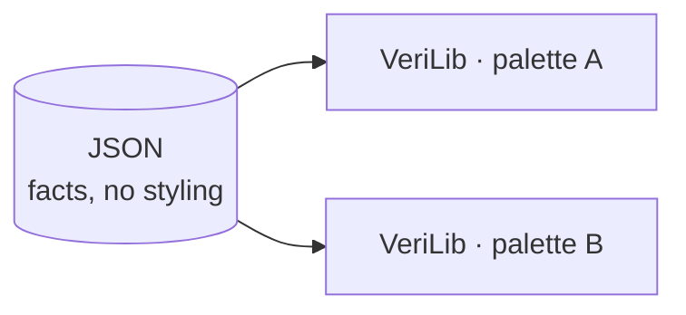

# Probes: factual data about (verified) code

---

## What the probes are

The probes use code indexers to extract structured data about a codebase. They read what the indexer already understands and write it down.


probe-aeneas has no indexer of its own. It uses probe-rust and probe-lean, and joins them.

---

## The probes generate JSON

Every probe emits the same shape of data: one entry per code atom (a rust function, a verus construct, a lean construct), with its dependencies. What each pipeline can say about an atom depends on what its indexer knows.

| Project | Typical information per atom |
|---------|------------------------------|
| Rust | function calls (the call graph) |
| Verus, Aeneas | function calls plus verification status |
| Lean | dependencies plus proof status |

The schemas for each probe are described in each probe repo. [Links](https://github.com/Beneficial-AI-Foundation/probe#per-tool-docs-across-the-ecosystem)

---

## A Verus atom

From `dalek-verus/.../verus_curve25519-dalek_4.1.3.json`. A Rust function, its calls, and whether it verifies against its spec.

```json
"probe:curve25519-dalek/4.1.3/.../[ProjectivePoint]double()": {
  "kind": "exec",
  "language": "rust",
  "code-path": "src/backend/serial/curve_models/mod.rs",
  "primary-spec": "requires\n  is_valid_projective_point(*self),\n  ensures ...",
  "verification-status": "transitively-verified",
  "dependencies": [
    "probe:.../[FieldElement51]square()",
    "probe:.../[FieldElement51]square2()"
  ]
}
```

---

## probe-aeneas: probe-rust plus probe-lean

An Aeneas project has two sides: the Rust crate, and the Aeneas-generated Lean that models it and the specs proved about it. probe-aeneas runs both probes and links their output.

- **probe-rust** indexes the Rust crate with rust-analyzer, and additionally runs Charon to tag each Rust function with a Charon-derived qualified name.
- **probe-lean** indexes the Lean side, where each Aeneas-generated definition remembers the Rust function it came from.

The Rust atoms carry rust-analyzer ids; the Lean translations speak Charon names. Charon is the shared vocabulary: tagging each rust-analyzer atom with its Charon-derived qualified name is what makes the two comparable. Matching those names links a Rust function to the Lean definition that implements it and the theorem that specifies it.

---

## An Aeneas atom: Rust and Lean, linked

The Rust function. Its `rust-qualified-name` is the Charon-derived name, and `translation-name` points to its Lean side.

```json
"probe:curve25519-dalek/4.2.0/edwards/impl<&Scalar>#[EdwardsPoint]mul_base()": {
  "kind": "exec",
  "language": "rust",
  "rust-qualified-name": "curve25519_dalek::edwards::{...EdwardsPoint}::mul_base",
  "translation-name": "probe:curve25519_dalek.edwards.EdwardsPoint.mul_base",
  "verification-status": "transitively-verified",
  "dependencies": ["probe:.../[Mul<&EdwardsBasepointTable>]mul()"]
}
```

The Lean translation it points to, paired with the theorem that specifies it.

```json
"probe:curve25519_dalek.edwards.EdwardsPoint.mul_base": {
  "kind": "def",
  "language": "lean",
  "rust-source": "curve25519-dalek/src/edwards.rs",
  "primary-spec": "probe:curve25519_dalek.edwards.EdwardsPoint.mul_base_spec",
  "verification-status": "verified",
  "dependencies": [
    "probe:...constants.ED25519_BASEPOINT_POINT",
    "probe:curve25519_dalek.edwards.EdwardsPoint"
  ]
}
```

---

## Three kinds of projects, three questions

We work with three kinds of projects (until now), and each asks a different question.

```
┌──────────────────┐  ┌──────────────────┐  ┌───────────────────┐
│  Functional      │  │  Mathlib-style   │  │  Security         │
│  verification    │  │  formalization   │  │  protocol (Lean)  │
│                  │  │                  │  │                   │
│   f ⊨ spec       │  │     ⊢  thm       │  │    AEAD           │
│                  │  │                  │  │                   │
│  "does f meet    │  │  "is it          │  │  "is the          │
│   its spec?"     │  │   proved?"       │  │   construction    │
│                  │  │                  │  │   secure?"        │
└──────────────────┘  └──────────────────┘  └───────────────────┘
```

The questions, to me, are different in nature and we should deal with each in a different way.

---

## One framework for all three can mislead

We could try to see all three types (and potentially other types of projects that will appear) in the same way. In the end, any program boils down to 0s and 1s. But i think by doing so we lose meaning.

---

## Probes provide data; VeriLib displays it

The probes have one job: provide factual data about the code, as JSON.

VeriLib takes that data and presents it currently by colors and statistics.

Colors and what to take as input for stats should be helpful but the questions "what colours, what stats" are also somewhat subjective (what one might find useful, another person would say "nay") so we need to reach consensus knowing we might not make everyone happy. 

Take-away: probes only report facts about the code and take no position on how those facts should appear on verilib.



---

## Typical probe bugs

- if a theorem appears as unproved when it should be proved
- if a construct doesn't appear in the json (for instance, what Sergiu noticed about private lean lemmas)
- more generally, inconsistencies between what the code says and what the json says

---


## Colors

With that separation in mind, we can talk about colors as a VeriLib concern, on top of the factual data the probes provide.


