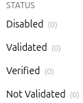
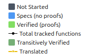

<!-- _class: lead -->

# Probes: factual data about (verified) code

A small tool ecosystem that reads what code indexers understand and writes it down as JSON.

---

## What the probes are

Code indexers already parse and understand a codebase. The probes read that understanding and emit **structured, factual data** — no interpretation, no styling.


**probe-aeneas** has no indexer of its own: it runs probe-rust and probe-lean and *joins* their output.

---

## The JSON: one entry per code atom

Every probe emits the same shape — one entry per atom (a Rust function, a Verus construct, a Lean construct) with its dependencies and status.

| Project | Typical information per atom |
|---------|------------------------------|
| Rust | function calls (the call graph) |
| Verus, Aeneas | calls + verification status; thm deps + proof status |
| Lean | theorem dependencies + proof status |

---

## A Verus atom

A Rust function, its calls, and whether it verifies against its spec.

```json
"probe:curve25519-dalek/.../[ProjectivePoint]double()": {
  "kind": "exec",
  "language": "rust",
  "primary-spec": "requires is_valid_projective_point(*self), ensures ...",
  "verification-status": "transitively-verified",
  "dependencies": [
    "probe:.../[FieldElement51]square()",
    "probe:.../[FieldElement51]square2()"
  ]
}
```

---

## probe-aeneas: Rust ↔ Lean, linked

An Aeneas project has two sides: the **Rust crate** and the **Aeneas-generated Lean** that models it plus the specs proved about it.

- **probe-rust** indexes the crate and tags each function with a **Charon-derived qualified name**.
- **probe-lean** indexes the Lean side, where each generated def remembers the Rust function it came from.

Charon names are the **shared vocabulary**: matching them links a Rust function to the Lean def that implements it and the theorem that specifies it.

---

## Where spec and proof live differ by tool

Same property (`FieldElement51::is_negative`), verified both ways.

<div class="small">

| Verus | Lean via Aeneas |
|-------|-----------------|
| Code, <span class="spec">spec</span> and <span class="verified">proof</span> are **one artifact** | Code is a plain `def`; <span class="spec">spec</span> + <span class="verified">proof</span> are a **separate theorem** |
| <span class="spec">spec</span> = `requires`/`ensures` contract | <span class="spec">spec</span> = the theorem's statement |
| <span class="verified">proof</span> = `proof { }` inside the fn | <span class="verified">proof</span> = the proof term |

</div>

This split is why "what does a Lean `def` mean?" is harder than in Verus — a `def` can be an impl, a spec, or neither.

---

## A Lean `def` is multi-faceted

Verus has dedicated syntax (`spec fn` vs `fn`). Lean has only `def` — one keyword for an implementation, a spec, or something else. **The syntax is identical**, so in general we cannot tell a spec-def from an impl-def.

Consequence: **no single colour per `def`** — it depends on the project.

- **Aeneas projects:** for Aeneas-generated translations (they model implementations) they get the colour of the specs, <span class="spec">blue</span> for defs that play the role of a Verus `spec fn`.
- **Mathlib-style projects:** there is a proposal to have a <span class="verified">green</span> dot to denote the def "**compiles**", not "meets a spec".
- **Verification projects done in Lean (like lean-zip):** without annotations we cannot distinguish defs representing impls from def representing specs 

---

## Three kinds of projects, three questions

```
┌──────────────────┐  ┌──────────────────┐  ┌───────────────────┐
│  Functional      │  │  Mathlib-style   │  │  Security         │
│  verification    │  │  formalization   │  │  protocol (Lean)  │
│                  │  │                  │  │                   │
│   f ⊨ spec       │  │     ⊢  thm       │  │    AEAD ⊨ secure  │
│                  │  │                  │  │                   │
│  "does f meet    │  │  "is thm         │  │  "is the AEAD     │
│   its spec?"     │  │   proved?"       │  │   construction    │
│                  │  │                  │  │   secure?"        │
└──────────────────┘  └──────────────────┘  └───────────────────┘
```

Different questions in nature — forcing all three into one framework loses meaning.

---

## Division of labour

The **probes** have one job: report factual data about the code, as JSON. They take **no position** on how it should look.

**VeriLib** takes that data and presents it — by colouring atoms and computing statistics.


What colours and which stats are **subjective**: helpful to one user, "nay" to another. So the colour/status choices below are a VeriLib concern to reach consensus on — not facts the probes emit.

---

## Currently

In VeriLib we see:

Statuses:


Colors:


There's a gap between them (we should have a 1-to-1 correspondence between statuses and colours)

---

## Statuses

The probes don't (cannot) emit info about:
- a function being tracked
- a spec being validated 

In the current verif projects:
- specs are validated through PRs, if a spec exists in the codebase, then it's validated
- there's nothing in the code saying that a function is tracked

---

## Colour ↔ status proposal

A one-to-one mapping between verification status and colour:

- <span class="disabled">disabled</span> — no spec / outside verification scope
- <span class="translated">translated</span> — Aeneas def with no spec yet
- <span class="sorry">sorry / assumes</span>
- <span class="error">error</span>
- <span class="verified">verified</span> — a function meets its spec, or a theorem is proved
- <span class="trusted">trusted</span> — axioms / assumed

---

## Shapes

Colours for statuses, shapes for roles:
- can be def/thm like in verso-blueprint; not sure if it makes sense for verus...
- can be impl/spec/proof; could make sense for Verus; not much for Lean spec-theorems; maybe just impl/spec? just have a shape for specs?

What we have in the jsons:
- kinds: def/abbrev/thm/... for lean; exec/spec/proof for verus

---

## Arrows

The following fields in the jsons from the probes can allow us to have different arrows:
- `translation-name`
- `primary-spec`
- `dependencies`

---

## Open question 1 — <span class="verified">green</span>

<span class="q">Should green mean *only* "satisfies its spec / is proved"?</span>

- If yes, **arbitrary Lean `def`s get no verification colour** ("this def compiles" is diff from "this function meets its spec").
- Aeneas-generated defs still get a colour: <span class="translated">translated</span> until specified, then the colour of their spec.
- for vcvio based projects, we can leverage info like [Jin implemented](https://github.com/Beneficial-AI-Foundation/probe-lean/blob/main/docs/classification-security-protocol.md)
- for verso-blueprint projects, we have a probe wrapping around verso-blueprint to get all that the user annotated 

---

## Open question 2 — <span class="spec">blue</span> for specs

<span class="q">Do we want blue for specs (the spec itself, not a specified function)?</span>

- If a function has a spec, it also has a proof → the outcome is already <span class="verified">green</span>/<span class="sorry">orange</span>/<span class="error">red</span>. <span class="spec">Blue</span> is "eaten".
- Only genuine case: **spec defs** used in pre/post-conditions (Verus `spec fn`, similar Aeneas defs).

Or we could see a spec as a **role** → maybe distinguish specs by **shape**, not colour.

---

## Open question 3 — tracking

<span class="q">Is every Rust function "tracked" by default?</span>

- **Yes** → a finished project needs an `outside_verif_scope` annotation, else it shows as incomplete (has an upper bound).
- **No** (current) → a function with no spec is disabled; no upper bound, but the progress chart still grows as specs are added.

---

## Open question 4 — pure Rust projects

<span class="q">Should VeriLib display pure Rust (unverified) projects at all?</span>

- If yes, what colour are those atoms?
- white (as neutral) conveys "not for verification" — but today white is *also* used for tracked functions, which is inconsistent.

---

## Open question 5 — "done"

<span class="q">When is a project done?</span>

- Verification: when Rust functions are <span class="verified">green</span>?
- Formalization: when theorems are <span class="verified">green</span>?
- Without a notion of tracking, **any intermediate state looks "done"**.

---

## Open question 6 — trusted / axioms

<span class="q">Distinguish axioms by colour (<span class="trusted">purple</span>) or by shape?</span>

- Colour lets us **quantify** how much is trusted (how much purple).
- Shape does not quantify as easily.


