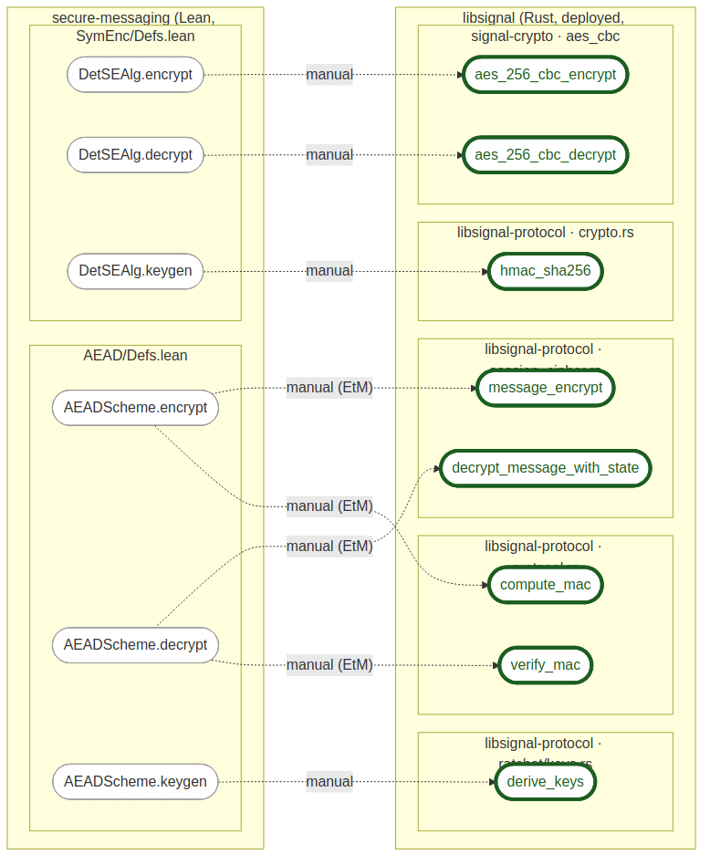
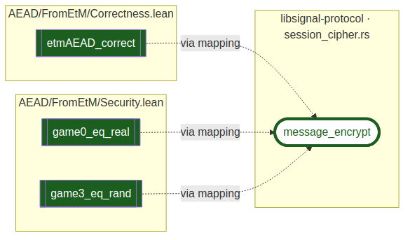

# Lean Verification Landscape

**Specs as First-Class Citizens**

How probe-lean could discover specifications across different Lean project types

---

## The problem

In **Verus**, specs are syntactically explicit: `requires`, `ensures`, `proof fn`.

In **Lean 4**, specs hide in **types**, **attributes**, **naming**, and **module structure** — no single syntax marks "this is a spec".

**How could probe-lean find them?**

---

## Colour key

One colour per atom, from its verification status (the convention proposed in the probes deck):

- Grey — in scope but not yet specified
- Yellow — translated or generated, but unspecified
- Blue — a stated spec, a condition that is not itself proved
- Orange — incomplete proof (a `sorry` or `assume`)
- Light Green — verified locally, some dependency still open
- Dark Green — transitively verified: it and everything it depends on
- Purple — trusted (an axiom or an assumed spec)
- Red — error: does not compile, or verification fails
- White — nothing to grade: a definition, or outside the verification scope

<!-- The diagram images follow this key. They are generated from the .mmd sources in img/ with mermaid-cli: `mmdc -i img/<name>.mmd -o img/<name>.png -b white`. -->

---

## The Lean project spectrum

| Project type | Example | Spec/impl split? |
|---|---|---|
| Pure math | Mathlib, FLT | No — theorems are the end product |
| Verified algorithm | lean-zip | Yes — native Lean vs. spec theorems |
| Formal reference spec | cedar-lean | Yes — Lean IS the spec |
| Verified library | Std `HashMap` + `LawfulBEq` | Yes — data structure + laws |
| Aeneas translation | baif/dalek-lean | Yes — Rust impl + Lean proofs |
| Crypto protocol | baif/secure-messaging | Yes — scheme + games |

---

## Spec pattern: Aeneas

Extrinsic specs via spec theorems on Aeneas-generated Lean translations. Grounded in `baif/curve25519-dalek-lean-verify`, three `FieldElement51` methods from `src/backend/serial/u64/field.rs`.

Color flows right-to-left: a Rust function is Dark Green only when its translation has a proved spec.

- `mul` is Dark Green: its translation carries the proved `mul_spec` (`Specs/.../FieldElement51/Mul.lean`).
- `conditional_swap` is Yellow: it is translated but has no spec, so there is nothing yet to verify against.
- `zeroize` is Grey: no translation at all, so it is outside the verification effort.

---

## Spec pattern: lean-zip

Three-layer stack: **FFI opaques** / **native implementations** / **specs and proofs**.

Module paths (`Zip/Native/` vs `Zip/Spec/`) cleanly separate the layers.

---

## Spec pattern: cedar-lean

Grounded in `Beneficial-AI-Foundation/cedar-lean`. Spec-as-implementation: the Lean `def`s in `Cedar/Spec` ARE the authorization specification.

- `isAuthorized` and `evaluate` are definitions (White): the spec itself, with nothing proved on them directly.
- `verifyIsAuthorized_is_sound` and `well_typed_is_sound` are transitively verified theorems in `Cedar/Thm` that prove properties about those defs.
- Which `Cedar/Spec` defs *should* carry a theorem is the denominator problem: the probe reports what is proved, not what ought to be.

---

## Spec pattern: secure-messaging (AEAD from Encrypt-then-MAC)

Grounded in `baif/secure-messaging`. The construction and the property definitions are `def`s; the correctness and security claims are theorems.

- Nodes: `AEADScheme` (a structure), the construction `etmAEAD` that instantiates it, and the properties `Correct` and `distAdvantage` are definitions (White); `etmAEAD_correct` and `etmAEAD_security` are transitively verified theorems.
- Edges are only what the probe actually records: a **solid** arrow is a reference in the atom's type/statement (`type-dependencies`), a **dotted** arrow is a reference in its body/proof (`term-dependencies`). So `etmAEAD : AEADScheme` and each theorem's statement mentioning `etmAEAD` are solid; `etmAEAD`'s body calling `DetSEAlg` is dotted.
- The probe does **not** label an edge "proves" or "bounds" — that is human interpretation, not extracted data.
- Every node's subgraph names the file (all under `SecureMessaging/`) where the atom lives.

---

## The denominator problem

**What is the "base set" for measuring verification progress?**

| Project | Base set | How identifiable? |
|---|---|---|
| Verus/Aeneas | Rust functions | Automatic — `language: "rust"` |
| lean-zip | `def`s in `Zip/Native/` | Semi-automatic — module path |
| Cedar | `def`s in `Cedar/Spec/` | Semi-automatic — module path |
| secure-messaging | Scheme ops + security games | Requires domain knowledge |

probe-lean can identify what *is* specified (`specs` field non-empty), but determining what *should* be specified requires curation, conventions, or attributes.

---

## Discovery tiers

**Tier 1 — Attributes** (most robust)
- `@[spec]` (Std.Do.Triple), `@[progress]` (Aeneas), `@[primary_spec]` (probe-lean)
- Inspectable from the environment, cross-project consistent, linter-enforceable

**Tier 2 — Framework types** (moderate)
- `Triple`, `RelTriple` → spec; `def Correct` returning `Prop` → correctness
- Requires probe-lean to understand framework-specific types

**Tier 3 — Naming conventions** (most fragile)
- `*_spec`, `*_correct`, `*_preserves_*`, `*Inv`
- Already partially used by probe-lean for `primary-spec` inference

**Complement: Verso Blueprint** — project management layer (roadmap, dependencies, progress). Code-level attributes and blueprint are complementary, not alternatives.

---

## Joint project: a proof meets deployed code

`probe merge` of probe-rust on libsignal with probe-lean on secure-messaging, joined by a manual `probe/mappings` file. Grounded in `secure-messaging/.verilib`.

- Left: secure-messaging's proved-secure model (Lean). Right: libsignal's deployed Rust, grouped by crate and file.
- Dashed **manual** arrows are the mapping (tool `manual`): a human claim that this Rust code realizes the abstract primitive, not a proof.
- The green **halo** (outline, not fill) means model-backed but not itself verified, distinct from a solid-green proved node.
- The `encrypt` and `decrypt` fans to two Rust functions each reveal Encrypt-then-MAC inside libsignal.

---

## Proof reach: what rests on one function

- Reversing the mapping: `message_encrypt` participates in three proved claims: `etmAEAD_correct` (correctness), and `game0_eq_real` and `game3_eq_rand` (security).
- If the mapping is faithful, that libsignal function inherits those guarantees; if the Rust changes, these are the proofs to recheck.
- Computed from the cross-language edges the merge flattened through the proof graph.

---
