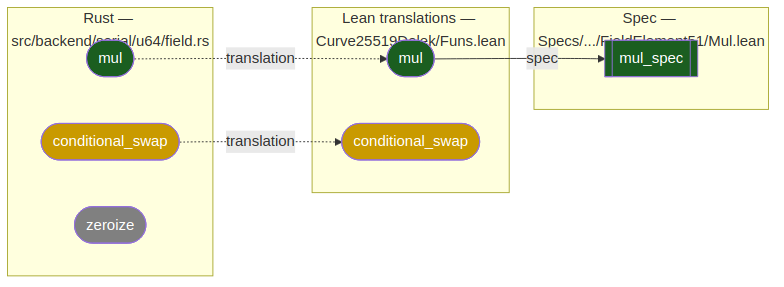
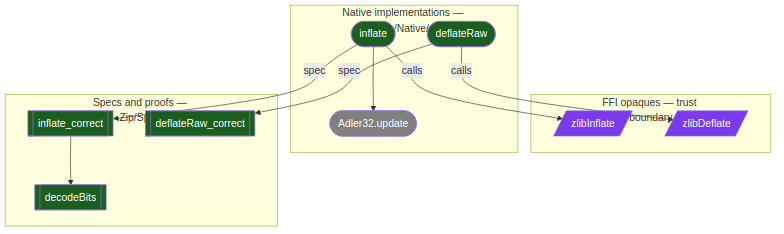
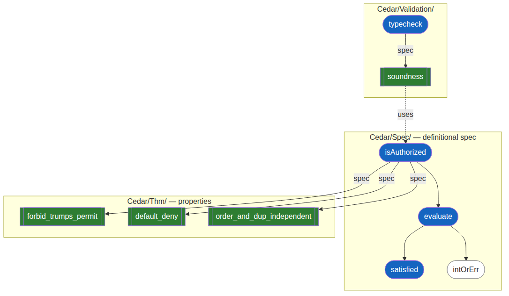
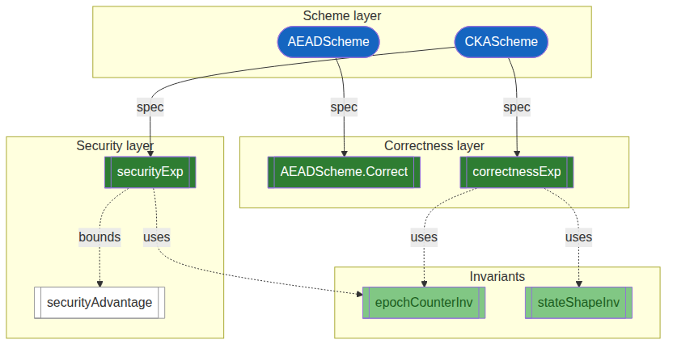
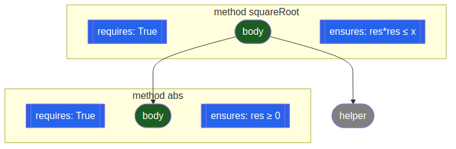

# Lean Verification Landscape

**Specs as First-Class Citizens**

How probe-lean could discover specifications across different Lean project types

---

## The problem

In **Verus**, specs are syntactically explicit: `requires`, `ensures`, `proof fn`.

In **Lean 4**, specs hide in **types**, **attributes**, **naming**, and **module structure** — no single syntax marks "this is a spec".

**How could probe-lean find them?**

---

## Colour key

One colour per atom, from its verification status (the convention proposed in the probes deck):

- Grey — in scope but not yet specified
- Yellow — translated or generated, but unspecified
- Blue — a stated spec, a condition that is not itself proved
- Orange — incomplete proof (a `sorry` or `assume`)
- Light Green — verified locally, some dependency still open
- Dark Green — transitively verified: it and everything it depends on
- Purple — trusted (an axiom or an assumed spec)
- Red — error: does not compile, or verification fails
- White — nothing to grade: a definition, or outside the verification scope

<!-- The diagram images follow this key. They are generated from the .mmd sources in img/ with mermaid-cli: `mmdc -i img/<name>.mmd -o img/<name>.png -b white`. -->

---

## The Lean project spectrum

| Project type | Example | Spec/impl split? |
|---|---|---|
| Pure math | Mathlib, FLT | No — theorems are the end product |
| Verified algorithm | lean-zip | Yes — native Lean vs. spec theorems |
| Formal reference spec | cedar-lean | Yes — Lean IS the spec |
| Verified library | Std `HashMap` + `LawfulBEq` | Yes — data structure + laws |
| Aeneas translation | baif/dalek-lean | Yes — Rust impl + Lean proofs |
| Crypto protocol | baif/secure-messaging | Yes — scheme + games |

---

## Spec pattern: Aeneas

Extrinsic specs via spec theorems on Aeneas-generated Lean translations. Grounded in `baif/curve25519-dalek-lean-verify`, three `FieldElement51` methods from `src/backend/serial/u64/field.rs`.

Color flows right-to-left: a Rust function is Dark Green only when its translation has a proved spec.

- `mul` is Dark Green: its translation carries the proved `mul_spec` (`Specs/.../FieldElement51/Mul.lean`).
- `conditional_swap` is Yellow: it is translated but has no spec, so there is nothing yet to verify against.
- `zeroize` is Grey: no translation at all, so it is outside the verification effort.

---

## Spec pattern: lean-zip

Three-layer stack: **FFI opaques** / **native implementations** / **specs and proofs**.

Module paths (`Zip/Native/` vs `Zip/Spec/`) cleanly separate the layers.

---

## Spec pattern: Cedar

**Spec-as-implementation** — the Lean `def`s ARE the specification.

White nodes like `intOrErr` — should they have theorems? This is the **denominator problem**.

---

## Spec pattern: secure-messaging (AEAD from Encrypt-then-MAC)

Grounded in `baif/secure-messaging`. The construction and the property definitions are `def`s; the correctness and security claims are theorems.

- `etmAEAD`, `Correct`, `guessAdvantage` are definitions: White, nothing to prove on their own.
- `etmAEAD_correct` and `etmAEAD_security` are transitively verified theorems that prove the construction meets `Correct` and bounds `guessAdvantage`.
- Every node's subgraph names the file (all under `SecureMessaging/`) where the atom lives.

---

## Spec pattern: Loom/Velvet

Specs are **inline** — `requires`/`ensures` are part of the method declaration.

`loom_solve` generates and discharges VCs automatically, so verified methods go straight to Dark Green. Unspecified helpers (Grey) are the only nodes without inline annotations.

---

## The denominator problem

**What is the "base set" for measuring verification progress?**

| Project | Base set | How identifiable? |
|---|---|---|
| Verus/Aeneas | Rust functions | Automatic — `language: "rust"` |
| lean-zip | `def`s in `Zip/Native/` | Semi-automatic — module path |
| Cedar | `def`s in `Cedar/Spec/` | Semi-automatic — module path |
| secure-messaging | Scheme ops + security games | Requires domain knowledge |

probe-lean can identify what *is* specified (`specs` field non-empty), but determining what *should* be specified requires curation, conventions, or attributes.

---

## Discovery tiers

**Tier 1 — Attributes** (most robust)
- `@[spec]` (Std.Do.Triple), `@[progress]` (Aeneas), `@[primary_spec]` (probe-lean)
- Inspectable from the environment, cross-project consistent, linter-enforceable

**Tier 2 — Framework types** (moderate)
- `Triple`, `RelTriple` → spec; `def Correct` returning `Prop` → correctness
- Requires probe-lean to understand framework-specific types

**Tier 3 — Naming conventions** (most fragile)
- `*_spec`, `*_correct`, `*_preserves_*`, `*Inv`
- Already partially used by probe-lean for `primary-spec` inference

**Complement: Verso Blueprint** — project management layer (roadmap, dependencies, progress). Code-level attributes and blueprint are complementary, not alternatives.

---
