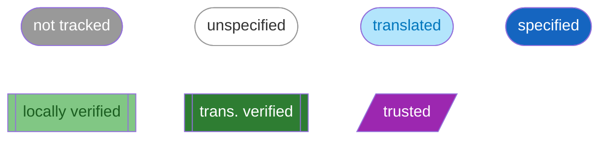
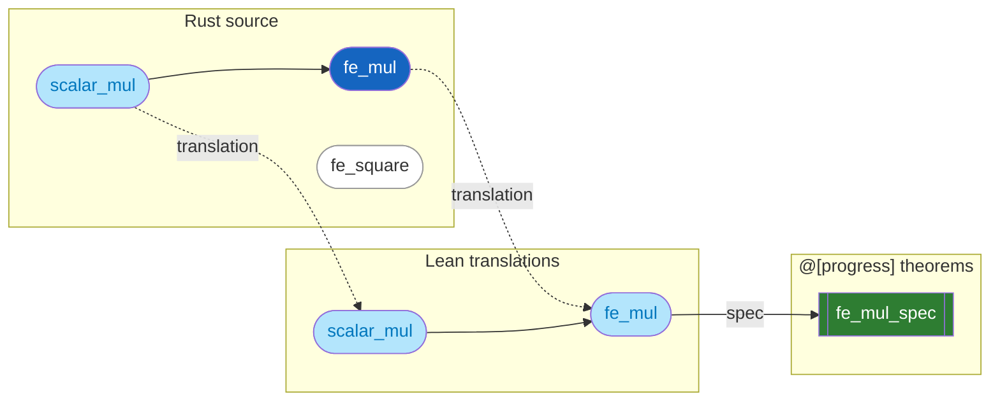
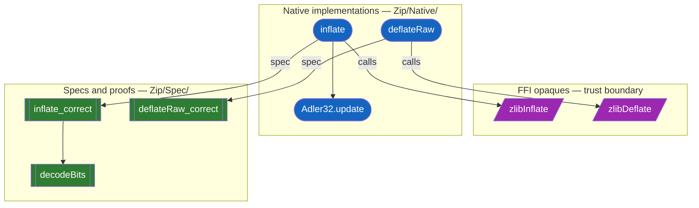
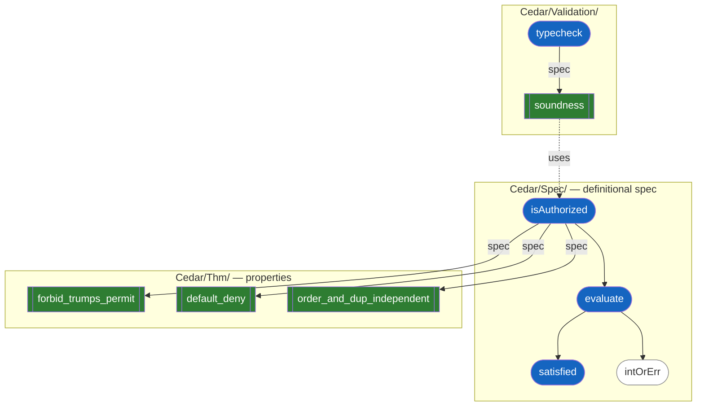
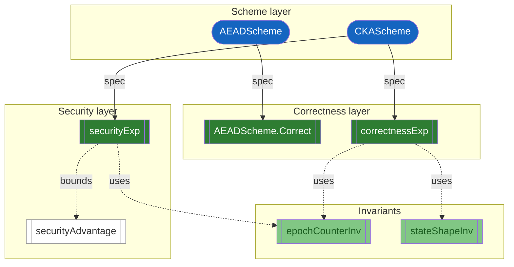
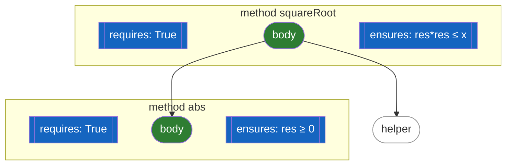

# Lean Verification Landscape: Specs as First-Class Citizens

How specifications surface in Lean 4 verification projects, and how probe-lean can discover them.

## The Lean project spectrum

Not all Lean projects are verification projects. Pure mathematics (Mathlib, FLT) formalizes theorems as end products — there is no implementation being checked against a spec. But when a Lean project has both *implementations and proofs about those implementations*, it is a verification project. The interesting question becomes: which declarations are specs, which are implementations, and which are supporting mathematical infrastructure?

Unlike Verus where specs are syntactically explicit (`requires`/`ensures` clauses), Lean embeds specs in its type system through multiple patterns. The challenge for [probe-lean](../tools/probe-lean.md) is discovering and categorizing them.

| Project type | Example | Spec/impl split? | probe-lean relevance |
|---|---|---|---|
| Pure math | Mathlib, FLT | No — theorems are the end product | Low — no impl to spec against |
| Verified algorithm | lean-zip | Yes — native Lean reimplements C algorithms, specs prove equivalence | Yes |
| Formal reference spec | cedar-lean | Yes — Lean IS the spec, theorems prove properties of it | Yes |
| Verified library | Std `HashMap` + `LawfulBEq` | Yes — data structure + correctness laws | Yes |
| Aeneas translation | baif/dalek-lean | Yes — Rust impl + Lean correctness proofs | Yes (via [probe-aeneas](../tools/probe-aeneas.md)) |
| Crypto protocol | baif/secure-messaging | Yes — scheme + correctness/security games | Yes |

probe-lean cares about everything right of pure math.

## Cross-cutting foundation: typeclass laws

The fundamental Lean pattern for bundling operations with required properties is the `Class` / `LawfulClass` split. For example, `Monad` defines operations (`pure`, `bind`) while `LawfulMonad` bundles the laws they must satisfy (`pure_bind`, `bind_assoc`). The same pattern appears in Mathlib: `Group` bundles `mul`, `inv`, `one` with associativity, identity, and inverse axioms.

This pattern recurs inside every framework described below. It is also what a "specs as structures" approach (bundling a function with its pre/postcondition and proof into a single typed object) generalizes. Not a project type for probe-lean to target directly, but the conceptual thread connecting all spec patterns in the Lean ecosystem.

## Spec patterns in Lean verification projects

### Aeneas: extrinsic specs via `@[progress]`

[Aeneas](https://github.com/AeneasVerif/aeneas) translates safe Rust into pure functional Lean code in the `Result α` monad (constructors: `ok`, `fail`, `div`). The generated code contains no specs — it is purely functional. Specs are written as separate theorems by the proof engineer:

```lean
@[progress]
theorem U32.add_spec (x y : U32) (h : ↑x + ↑y ≤ U32.max) :
    ∃ z, x + y = ok z ∧ ↑z = ↑x + ↑y := ...
```

The `@[progress]` attribute registers the theorem in a database. Aeneas's custom `progress` tactic looks it up by pattern-matching on the function call expression, proves the precondition, and updates the proof context with the postcondition. A companion `scalar_tac` tactic handles arithmetic side-conditions.

**Discovery**: scan for `@[progress]`-tagged theorems. The attribute is the sole discovery mechanism.

References: [ICFP 2022 paper](https://arxiv.org/abs/2206.07185), [ICFP 2024 paper](https://arxiv.org/abs/2404.02680).

### Loom/Velvet: Dafny-style `requires`/`ensures`

[Loom](https://github.com/verse-lab/loom) (POPL 2026) is a framework for building foundational verifiers inside Lean 4 via monadic shallow embedding. It derives weakest-precondition transformers automatically using Monad Transformer Algebras. [Velvet](https://github.com/verse-lab/velvet), built on Loom, provides a Dafny-like DSL:

```lean
method squareRoot (x : Nat)
  requires True
  ensures fun res => res * res ≤ x ∧ x < (res + 1) * (res + 1) := do
  ...
  done_with loom_solve
```

`requires`, `ensures`, and `invariant` are Lean macros that expand into monadic structures. The `loom_solve` tactic generates VCs and discharges them via Z3/cvc5 or Lean tactics.

**Discovery**: identify `method` declarations with `requires`/`ensures` macro expansions. Specs are syntactically part of the function definition.

References: [Loom preprint](https://ilyasergey.net/assets/pdf/papers/loom-preprint.pdf), [Velvet repo](https://github.com/verse-lab/velvet).

### Std.Do.Triple: Lean stdlib Hoare logic

Since Lean 4.22 (August 2025), the standard library includes `Std.Do.Triple` — a Hoare logic for monadic programs with stateful effects (`IO`, `StateT`, `ExceptT`):

```lean
⦃P⦄ prog ⦃Q⦄   -- syntactic sugar for Triple prog P Q
```

The `@[spec]` attribute registers theorems as specifications. The `mspec` tactic applies them; `mvcgen` decomposes Hoare triple goals into pure verification conditions.

**Discovery**: scan for `@[spec]`-tagged theorems. This is now the standard Lean mechanism for tagging specs on monadic programs.

References: [Lean 4.22 release notes](https://lean-lang.org/doc/reference/latest/releases/v4.22.0/), [PR #8995](https://github.com/leanprover/lean4/pull/8995).

### VCVio: game-based crypto specs

[VCVio](https://github.com/Verified-zkEVM/VCV-io) is a foundational framework for verified cryptographic proofs. Computations with oracle access are represented as `OracleComp spec α` (a free monad over the oracle specification's polynomial functor). It extends Loom to the relational setting.

In VCVio, "specs" are multi-layered:

| Layer | How it appears | Example |
|---|---|---|
| Scheme interface | Lean `structure` bundling operations | `AEADScheme`, `CKAScheme` |
| Correctness | `Prop` or game experiment | `AEADScheme.Correct`, `correctnessExp` |
| Security definition | Probabilistic game (`ProbComp Bool`) | `securityExp`, `securityAdvantage` |
| Security proof | Theorem bounding advantage | (reductions, forking lemma) |

The program logic provides unary Hoare triples (`by_hoare` / `vcstep`) and relational triples (`by_equiv` / `rvcstep` via `RelTriple`).

**Discovery**: identify `structure *Scheme`, `def Correct`, `def securityExp`, `def securityAdvantage`, and theorems using `by_hoare` / `by_equiv`. The type structure itself distinguishes correctness from security.

References: [VCVio paper (ePrint 2026/899)](https://eprint.iacr.org/2026/899), [ArkLib repo](https://github.com/Verified-zkEVM/ArkLib).

## What we see in baif/secure-messaging

`baif/secure-messaging` is a VCVio-based crypto verification project. Concrete patterns:

- **Scheme structures** bundle operations: `AEADScheme` (keygen, encrypt, decrypt), `CKAScheme` (initKeyGen, sendA, recvB, ...).
- **Correctness spec** is a `Prop`: `AEADScheme.Correct` asserts decrypt-after-encrypt roundtrips. CKA correctness uses a game experiment (`correctnessExp`).
- **Security spec** is a probabilistic game: `securityExp` runs an adversary with oracle access and checks if it wins. `securityAdvantage` computes `|Pr[win] - 1/2|`.
- **Invariants** (`epochCounterInv`, `stateShapeInv`, `reachableInv`) are explicit `Prop`-valued predicates, threaded through `PreservesInv` proofs — Hoare-style reasoning done manually.
- **Proven theorems**: DDH-CKA correctness (`Pr[correctnessExp wins] = 1`), AEAD advantage equivalence.
- **Relational reasoning**: `ToVCVio/` provides `RelTriple` infrastructure for security reductions (coupling-based).
- **No custom attributes** today. Categorization (correctness vs. security) is implicit in the types and naming.

## Case studies: lean-zip and Cedar

Two external Lean projects illustrate how the impl/spec boundary varies across project types.

### lean-zip: verified algorithm with clean layers

[lean-zip](https://github.com/kim-em/lean-zip) verifies a ZIP/gzip implementation. It has three well-separated layers:

| Layer | Directory | `kind` / attribute | Role |
|---|---|---|---|
| FFI opaques | top-level | `opaque` + `@[extern]` | Trust boundary — C code in `c/zlib_ffi.c`, no Lean body |
| Native implementations | `Zip/Native/` | `def` | Pure Lean reimplementations: `inflate`, `deflateRaw`, `Adler32.update` |
| Specs and proofs | `Zip/Spec/` | `def` (reference impls) + `theorem` | Reference functions (`decodeBits`) and correctness theorems (`inflate_correct`) |

This maps closely to the Verus/Aeneas model: the native `def`s are the implementations being verified, the `Spec/` theorems are the specs, and `@[extern]` opaques are trusted. The project's own progress metric is **sorry count** (0 → 15 during refactoring → 0 repaired), not function coverage.

**Discovery signals**: `@[extern]` identifies trust boundary. Module path (`Zip/Native/` vs `Zip/Spec/`) separates impl from spec. `kind == "theorem"` identifies proofs.

### Cedar: formal reference specification

[cedar-lean](https://github.com/cedar-policy/cedar-spec/tree/main/cedar-lean) formalizes the Cedar authorization policy language. Unlike lean-zip, there is **no FFI layer** — the Lean code IS the authoritative specification.

| Directory | `kind` | Role |
|---|---|---|
| `Cedar/Spec/` | `def` | Definitional specification: `evaluate`, `isAuthorized`, `satisfied` |
| `Cedar/Thm/` | `theorem` | Properties of the spec: `forbid_trumps_permit`, `default_deny`, `order_and_dup_independent` |
| `Cedar/Validation/` | `def` + `theorem` | Type-checker and its soundness proofs |

The production Rust implementation lives in a separate repo (`cedar-policy/cedar`). Correspondence between Lean spec and Rust code is established via differential random testing, not formal proof.

**Discovery signals**: `kind == "theorem"` separates proofs from defs. But within `def`s, there is no mechanical way to distinguish core spec functions (`isAuthorized`) from utility helpers (`intOrErr`). The `specs` reverse-dependency field shows which defs have theorems about them, but cannot determine which defs *should* have theorems.

### The denominator problem

These projects expose a fundamental challenge: **what is the "base set" for measuring verification progress?**

| Project | Base set | How identifiable? |
|---|---|---|
| Verus/Aeneas | Rust functions | Automatic — `language: "rust"` |
| lean-zip | `def`s in `Zip/Native/` | Semi-automatic — module path heuristic |
| Cedar | `def`s in `Cedar/Spec/` | Semi-automatic — module path heuristic |
| secure-messaging | Scheme operations + security games | Requires domain knowledge |

probe-lean can identify what IS specified (via the `specs` field — non-empty means theorems exist about this def), but determining what SHOULD be specified requires either curation (`is-relevant` config flag), module-path conventions, or custom attributes.

## Visualization: what graphs look like per project type

The diagrams below illustrate the characteristic graph topology for each Lean project category. Colors follow the [verification status palette](../../docs/verification-statuses.md). Node shapes encode roles: rounded rectangles for implementations, double-bordered rectangles for specs and theorems, and parallelograms for trusted/axiomatic declarations. Edge styles: solid arrows for calls and spec edges, dashed arrows for cross-language translations.

### Color legend



### Aeneas (dalek-lean): bilingual graph with translation edges



Dashed edges cross the language boundary (Rust to Lean); solid spec edges connect translations to their `@[progress]` theorems. A Rust function is Dark Blue only when its translation has a spec — `fe_mul` is specified while `scalar_mul` is only translated (Light Cyan) and `fe_square` has no translation at all (White).

### lean-zip: three-layer stack



Three clean layers. Purple `@[extern]` opaques form the trust boundary — C code with no Lean body. Blue native `def`s reimplement the algorithms in pure Lean. Green theorems and reference specs (like `decodeBits`) prove equivalence. Module paths (`Zip/Native/` vs `Zip/Spec/`) cleanly separate the layers.

### Cedar: spec-as-implementation with theorem layer



In Cedar the Lean `def`s ARE the specification — there is no separate implementation language. White helper defs like `intOrErr` illustrate the denominator problem: they are tracked but it is unclear whether they need their own theorems. The Validation subgraph connects back to the core spec via its soundness proof.

### VCVio / secure-messaging: layered scheme-correctness-security



VCVio graphs are layered vertically: schemes define operations, correctness and security games define properties, invariants support the proofs. White nodes (like `securityAdvantage`) mark WIP definitions not yet connected to a proven theorem. Light Green invariants are locally verified but their proofs do not yet compose transitively.

### Loom/Velvet: methods with inline specs



Loom/Velvet methods carry their specs inline — `requires` and `ensures` are part of the method declaration, not separate theorem nodes. Each subgraph bundles a method with its pre/postconditions. Call edges connect bodies. `loom_solve` generates and discharges VCs automatically, so verified methods go straight to Dark Green. Unspecified helpers (White) stand out as the only nodes without inline annotations.

## Discovery strategies for probe-lean

Three tiers, from most robust to most fragile:

### Tier 1: Attributes (most robust)

Lean attributes are the canonical discovery mechanism. They are:
- Inspectable from the environment (no source parsing needed)
- Cross-project consistent (same attribute means the same thing everywhere)
- Linter-enforceable (warn if a theorem about `correctnessExp` lacks a tag)

Relevant attributes today:

| Attribute | Framework | Meaning |
|---|---|---|
| `@[spec]` | Std.Do.Triple | Hoare triple specification for `mspec`/`mvcgen` |
| `@[progress]` | Aeneas | Specification for `progress` tactic |
| `@[primary_spec]` | probe-lean | Primary spec for a definition (already supported) |
| `@[simp]` | General | Simplification lemma (not a spec per se, but relevant) |

Alessandro proposed the following attributes for baif security protocols projects:

| Attribute | Meaning |
|---|---|
| `@[correctness_spec]` | Functional correctness property |
| `@[security_spec]` | Security/indistinguishability property |

### Tier 2: Framework types (moderate)

When attributes are absent, inspect the types of theorems and definitions:
- Conclusion mentions `Triple` or `RelTriple` → spec (Std.Do / VCVio)
- `def Correct` returning `Prop` on a scheme → correctness spec
- `def securityExp` / `def securityAdvantage` → security spec
- Structure fields containing both operations and `Prop`-typed proof obligations → bundled spec

This requires probe-lean to understand framework-specific types, making it more fragile than attributes.

### Tier 3: Naming conventions (most fragile)

Suffix-based heuristics as a fallback:
- `*_spec` → likely a specification theorem
- `*_correct`, `*_correctness` → correctness property
- `*_preserves_*` → invariant preservation lemma
- `*Inv` → invariant definition

Already partially used by probe-lean (the `<name>_spec` convention for `primary-spec` inference — see [probe-lean § Specs as reverse dependencies](../tools/probe-lean.md)).

### Alternative: Verso Blueprint as a discovery source

[Verso Blueprint](https://github.com/leanprover/verso) (used by `baif/secure-messaging`) provides a structured documentation layer that links informal mathematical descriptions to Lean declarations. Blueprint chapters declare items with labels, Lean bindings, and dependency edges:

```lean
:::definition "aead_correctness" (parent := "aead") (lean := "AEADScheme.Correct")
:::theorem "cka_from_ddh_correctness" (parent := "cka") (lean := "ddhCKA.correctness")
```

The generated `blueprint-preview-manifest.json` is machine-readable and includes: label → Lean name mappings, formalization status (complete / sorry / missing), and the full dependency DAG via `{uses "..."}[]` edges.

**What blueprint gives you that attributes don't:**
- A **roadmap**: informal-only entries (no `lean := "..."`) mark what's planned but not yet formalized
- **Dependency structure** between spec items (e.g. security proof uses correctness definition)
- **Progress dashboard** with per-item status badges
- **Grouping** by domain (`aead`, `cka`, `fs_aead`) via `(parent := "...")`

**What blueprint doesn't give you:**
- **No role taxonomy**: correctness vs. security vs. construction must be inferred from label naming conventions (`_correctness`, `_security`, `_construction`), not from structured metadata. The `(tags := ...)` field exists but isn't used.
- **Doc-authoritative, not code-authoritative**: the blueprint lives in `docs/`, not in the Lean library. You can't discover blueprint membership by scanning `SecureMessaging/` alone.
- **Incomplete coverage**: in `secure-messaging`, 32 of 42 blueprint entries are informal-only (no Lean binding yet). The blueprint describes intent, not necessarily reality.

**Blueprint and attributes are complementary, not alternatives.** Blueprint is the project management layer (what should exist, what's done, what depends on what). Attributes are the code-level layer (this theorem IS a correctness spec, mechanically discoverable by probe-lean). A project could use both: `@[correctness_spec]` for probe-lean discovery + `(lean := "AEADScheme.Correct")` in the blueprint for progress tracking.

## Recommendation: custom attributes as lightweight index

Attributes are the right strategy for baif projects because they are:

1. **Redundant with type information** (by design). A linter can verify that every theorem about `correctnessExp` is tagged `@[correctness_spec]` — the tag doesn't add semantic information, it adds discoverability.
2. **Framework-independent**. Whether the project uses VCVio, Aeneas, or raw Lean, the same `@[correctness_spec]` tag means the same thing.
3. **Naming-independent**. A project that calls its correctness definition `soundness` instead of `Correct` still gets discovered.
4. **Cheap to adopt**. Adding `@[correctness_spec]` to an existing theorem is a one-character edit.

The `@[primary_spec]` attribute already exists in probe-lean's extraction pipeline. Extending to `@[correctness_spec]` and `@[security_spec]` would give probe-lean a uniform mechanism to classify specs across all baif Lean projects.

## Comparison table

| Framework | Spec representation | Discovery | Tactic | Attribute | Used by |
|---|---|---|---|---|---|
| Aeneas | Extrinsic theorem on `Result`-returning function | `@[progress]` | `progress` | `@[progress]` | dalek-lean |
| Loom/Velvet | `requires`/`ensures` macros in `method` | Macro expansion | `loom_solve` | — | Velvet, Veil |
| Std.Do.Triple | `⦃P⦄ prog ⦃Q⦄` (`Triple`) | `@[spec]` | `mspec`, `mvcgen` | `@[spec]` | Lean stdlib programs |
| VCVio | Schemes + games + advantage bounds | Framework types | `vcstep`, `rvcstep` | — | secure-messaging, ArkLib |
| Typeclass laws | `Class` / `LawfulClass` split | `Lawful*` instances | `simp`, `rfl` | — | Cross-cutting |
| Custom (proposed) | Any correctness/security property | `@[correctness_spec]`, `@[security_spec]` | — | `@[correctness_spec]`, `@[security_spec]` | All baif Lean projects |

## References

- [Verso Blueprint](https://github.com/leanprover/verso) — Document genre for Lean formalization project planning
- [LeanArchitect](https://github.com/hanwenzhu/LeanArchitect) — Lean-native blueprint extraction with `@[blueprint]` attribute
- [lean-zip](https://github.com/kim-em/lean-zip) — Verified ZIP/gzip in Lean 4 with FFI + native + spec layers
- [cedar-lean](https://github.com/cedar-policy/cedar-spec/tree/main/cedar-lean) — Formal specification of Cedar authorization language
- [Aeneas repo](https://github.com/AeneasVerif/aeneas) — Rust verification by functional translation
- [Loom repo](https://github.com/verse-lab/loom) — Framework for foundational multi-modal verifiers
- [Velvet repo](https://github.com/verse-lab/velvet) — Dafny-style verifier on Loom
- [VCVio repo](https://github.com/Verified-zkEVM/VCV-io) — Verified cryptography in Lean 4
- [VCVio paper (ePrint 2026/899)](https://eprint.iacr.org/2026/899) — Oracle effects, handlers, and relational program logic
- [Lean 4.22 release notes](https://lean-lang.org/doc/reference/latest/releases/v4.22.0/) — `Std.Do.Triple` introduction
- [seLe4n](https://sele4n.org/) — Microkernel in Lean 4 with Operations/Invariant split
